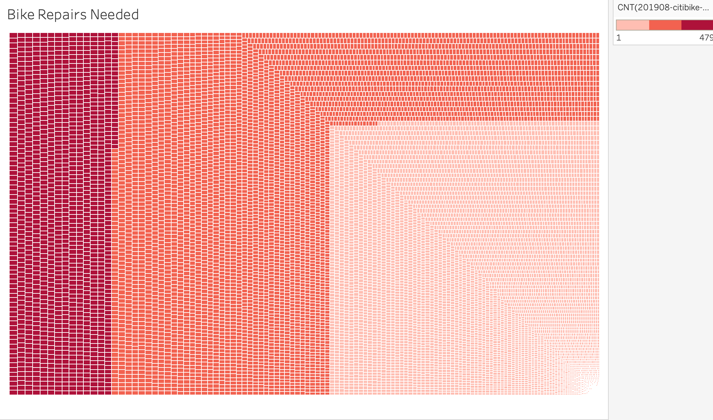
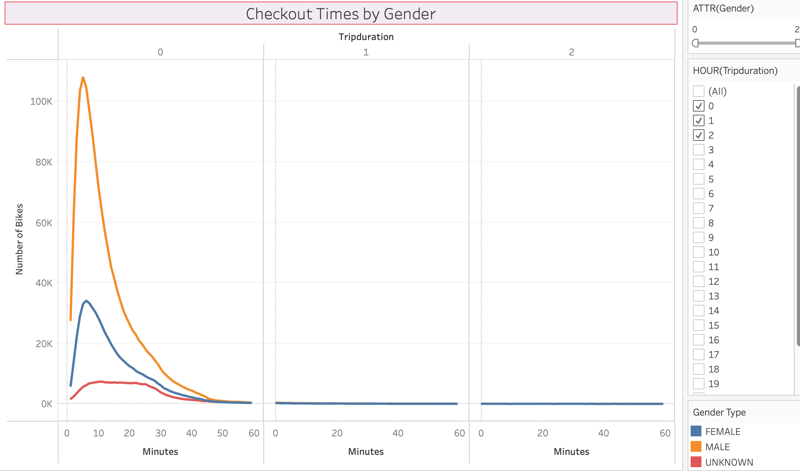

# bikesharing

## Overview
This project is designed to provide an analysis and feasibility study for a bike sharing program in Des Moines. Since a program already exists in New York City, their data was evaluated for this analysis.

## Results
Tableau was used to provide visualizations of the NYC bikesharing program. A sample of some of them include:

  

[Check Out My Story](https://public.tableau.com/app/profile/karen.gutierrez5128/viz/Bikesharing_16311251651470/DesMoineBikeAnalysis?publish=yes)

## Summary
It is hardly useful to leverage the bikesharing data in New York City, where the population is over 8.5M people, to that of Des Moine whose population is 215.6K. In addition, the density of each downtown is not compatible. This assessment is better leveraged by other major cities in the United States. 
